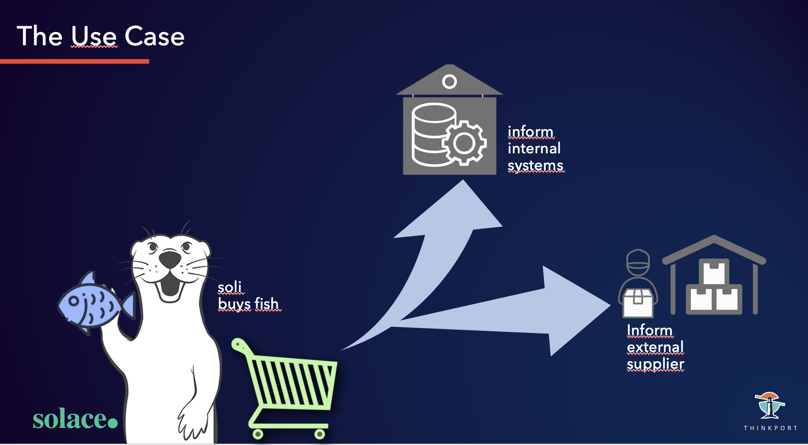
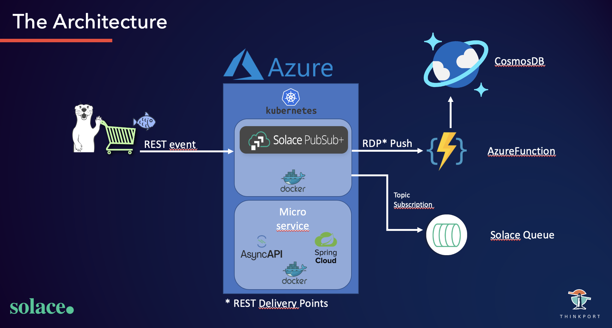

# kafka-summit-solace-demo


## Use Case




## Architecture



## Generate microservices

Execute in an env where docker is installed
```bash
sudo docker run --rm -it \
-v CheckoutToSupplierFilter.yaml:/app/asyncapi.yml \
-v ./generated:/app/output \
asyncapi/generator -o /app/output -p binder=solace -p view=provider -p actuator=true -p artifactId=ArticleToSupplierFilter -p groupId=thinkport.kafkasummit -p javaPackage=thinkport.kafkasummit.filter -p host=tcps://xxx.messaging.solace.cloud:55443 -p username=solace-cloud-client -p password=xxx -p msgVpn=retail-platform /app/asyncapi.yml https://github.com/asyncapi/java-spring-cloud-stream-template.git --force-write
```


